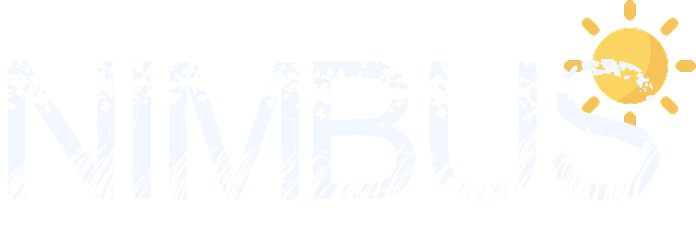

  

## About Me

CS student at La Rochelle University. Passionate about full-stack development and 3D Modeling.

- Currently learning Spring Boot & cloud deployment
- Interested in machine learning & automation

## Featured Projects

<table border="0" cellspacing="0" cellpadding="10">
  <tr>
    <th align="center">Name</th>
    <th align="left">Description</th>
    <th align="left">Context</th>
    <th align="center">Links</th>
  </tr>
  <tr>
    <td align="center" valign="middle">
       
      <strong>Nimbus</strong> 
    </td>
    <td valign="middle">Weather dashboard to check forecasts and current conditions for any city using live weather data.</td>
    <td valign="middle">Learning & Practicing</td>
    <td align="center" valign="middle">
       
      
    </td>
  </tr>
  <tr>
    <td align="center" valign="middle">
       
      <strong>Currency Converter</strong> 
    </td>
    <td valign="middle">Simple tool for rapid conversion among major currencies using live exchange rates.</td>
    <td valign="middle">Learning & Practicing</td>
    <td align="center" valign="middle">
       
      
    </td>
  </tr>
</table>

## Technical Skills

<table border="0" cellspacing="0" cellpadding="6">
  <tr><td align="center" valign="middle"><h4>Frontend</h4></td><td valign="middle">   </td></tr>
  <tr><td align="center" valign="middle"><h4>Backend</h4></td><td valign="middle">   </td></tr>
  <tr><td align="center" valign="middle"><h4>Databases</h4></td><td valign="middle">  </td></tr>
  <tr><td align="center" valign="middle"><h4>Systems</h4></td><td valign="middle">  </td></tr>
  <tr><td align="center" valign="middle"><h4>Cloud & DevOps</h4></td><td valign="middle">    </td></tr>
  <tr><td align="center" valign="middle"><h4>Tools</h4></td><td valign="middle"> </td></tr>
</table>

## Socials

[![LinkedIn](https://img.shields.io/badge/LinkedIn-0f172a?style=for-the-badge&logo=data:image/svg+xml;base64,PHN2ZyB3aWR0aD0nMjU2JyBoZWlnaHQ9JzI1NicgeG1sbnM9J2h0dHA6Ly93d3cudzMub3JnLzIwMDAvc3ZnJyBwcmVzZXJ2ZUFzcGVjdFJhdGlvPSd4TWlkWU1pZCcgdmlld0JveD0nMCAwIDI1NiAyNTYnPjxwYXRoIGQ9J00yMTguMTIzIDIxOC4xMjdoLTM3LjkzMXYtNTkuNDAzYzAtMTQuMTY1LS4yNTMtMzIuNC0xOS43MjgtMzIuNC0xOS43NTYgMC0yMi43NzkgMTUuNDM0LTIyLjc3OSAzMS4zNjl2NjAuNDNoLTM3LjkzVjk1Ljk2N2gzNi40MTN2MTYuNjk0aC41MWEzOS45MDcgMzkuOTA3IDAgMCAxIDM1LjkyOC0xOS43MzNjMzguNDQ1IDAgNDUuNTMzIDI1LjI4OCA0NS41MzMgNTguMTg2bC0uMDE2IDY3LjAxM1pNNTYuOTU1IDc5LjI3Yy0xMi4xNTcuMDAyLTIyLjAxNC05Ljg1Mi0yMi4wMTYtMjIuMDA5LS4wMDItMTIuMTU3IDkuODUxLTIyLjAxNCAyMi4wMDgtMjIuMDE2IDEyLjE1Ny0uMDAzIDIyLjAxNCA5Ljg1MSAyMi4wMTYgMjIuMDA4QTIyLjAxMyAyMi4wMTMgMCAwIDEgNTYuOTU1IDc5LjI3bTE4Ljk2NiAxMzguODU4SDM3Ljk1Vjk1Ljk2N2gzNy45N3YxMjIuMTZaTTIzNy4wMzMuMDE4SDE4Ljg5QzguNTgtLjA5OC4xMjUgOC4xNjEtLjAwMSAxOC40NzF2MjE5LjA1M2MuMTIyIDEwLjMxNSA4LjU3NiAxOC41ODIgMTguODkgMTguNDc0aDIxOC4xNDRjMTAuMzM2LjEyOCAxOC44MjMtOC4xMzkgMTguOTY2LTE4LjQ3NFYxOC40NTRjLS4xNDctMTAuMzMtOC42MzUtMTguNTg4LTE4Ljk2Ni0xOC40NTMnIGZpbGw9JyMwMDc3QjUnLz48L3N2Zz4=)](https://www.linkedin.com/in/salimzidane/)

